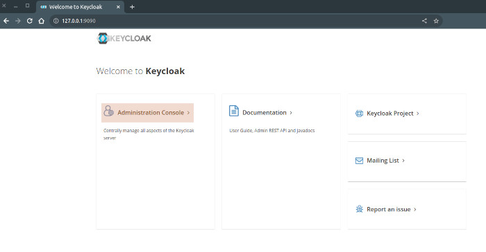
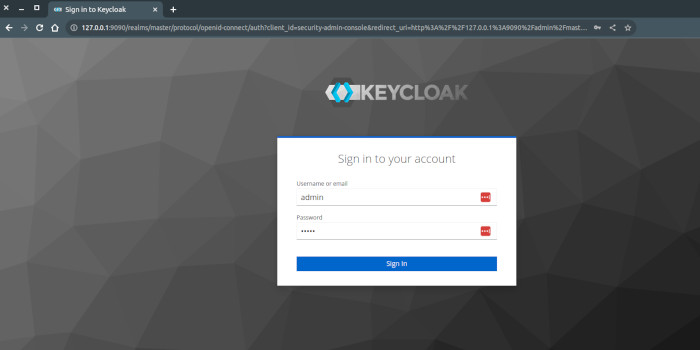

# Keycloack Demo !!! POC !!!

## Installation...

Construire l'image PHP utilisée dans le docker-compose.yaml (! image non optimisée !)

```shell
cd php-dev-8.2.6
docker build . -t php-dev:8.2.6
```
Ou utilisez votre propre image PHP (8.2) : modifier le docker-compose.yaml 

Installer les vendors des app avec php-dev:8.2.6

```shell
make install_client
make install_resource
```

Ajouter à /etc/hosts

```text
127.0.0.1 keycloack-demo
127.0.0.1 demo-client
127.0.0.1 demo-resource
```

Lancer les applications avec Docker Compose (la mise en route est relativement longue + de 30 secondes)

```shell
# à la racine du projet
make up
```

Pour tout arrêter

```shell
# à la racine du projet
make down
```

## Accès à Keycloack



Dans un navigateur, aller sur http://keycloack-demo

Cliquer sur "Administration Console"



- Username : admin
- Password : admin
